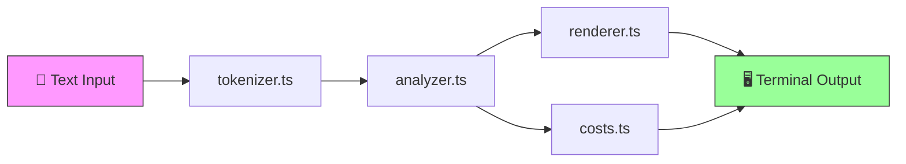

# 🔍 TokenLens

**A terminal token budget analyzer for prompt engineers and LLM developers.**

Tokenize any text, visualize density per section, and instantly calculate cost estimates for GPT-4o, Claude 3.5 Sonnet, Gemini 1.5 Pro, and more — all from your terminal.

---

## Why TokenLens Exists

LLM API costs are invisible until you get a bill. When you're crafting prompts, you don't know how many tokens you're actually using — or what it'll cost — until it's already been sent and billed.

**TokenLens makes token usage tangible before you send anything.** Paste or pipe any text, and instantly see per-section token counts, visual density charts, and cost breakdowns across multiple models.

---

## ✨ Features

- **BPE-Approximation Tokenizer** — cl100k_base-style token counting without external dependencies
- **Multi-Segment Analysis** — Split by line, paragraph, or sentence with per-segment token counts
- **Unicode Bar Chart Visualization** — Color-coded density bars (green → yellow → red) right in your terminal
- **Multi-Model Cost Calculator** — Instant cost estimates for GPT-4o, Claude 3.5 Sonnet, and Gemini 1.5 Pro
- **JSON Output Mode** — Pipe results into other tools with `--output json`
- **Stdin Support** — Pipe text directly: `cat prompt.txt | tokenlens analyze -`
- **Zero External Tokenizer Dependencies** — No Python, no WASM, no API calls needed

---

## 🏗️ Architecture



**Data flow:**

```
Input (file / stdin)
  → Tokenizer (BPE approximation, segment splitting)
    → Analyzer (statistics: total, max, avg, density map)
      → Renderer (bar charts + summary)  
      → Cost Calculator (multi-model pricing)
        → Terminal Output (table or JSON)
```

---

## 🔧 How It Works

1. **Input** — Read text from a file or stdin pipe
2. **Tokenize** — Split text into segments (line/paragraph/sentence) and estimate tokens using cl100k_base heuristics (word boundaries, punctuation splitting, ~4 chars/token for English)
3. **Analyze** — Compute total tokens, per-segment counts, max/avg stats, and a normalized density map (0–1)
4. **Cost** — Apply published pricing for GPT-4o ($5/$15 per 1M), Claude 3.5 Sonnet ($3/$15 per 1M), and Gemini 1.5 Pro ($1.25/$5 per 1M)
5. **Render** — Display a color-coded bar chart, summary stats, and a cost comparison table

---

## 🚀 Setup

```bash
# Clone the repository
git clone https://github.com/DucChau/tokenlens.git
cd tokenlens

# Install dependencies
npm install

# Build
npm run build
```

---

## 📖 Usage

### Analyze a file

```bash
tokenlens analyze myfile.txt
```

### Pipe from stdin

```bash
cat prompt.txt | tokenlens analyze -
```

### Choose segmentation

```bash
tokenlens analyze myfile.txt --segment line
tokenlens analyze myfile.txt --segment sentence
tokenlens analyze myfile.txt --segment paragraph   # default
```

### JSON output

```bash
tokenlens analyze myfile.txt --output json
```

### Development mode

```bash
npm run dev -- analyze myfile.txt
```

---

## 📊 Example Output

```
╔══════════════════════════════════════════════╗
║        🔍 TokenLens — Token Analysis        ║
╚══════════════════════════════════════════════╝

  Total Tokens:    1,247
  Segments:        8
  Max (segment):   312
  Avg (segment):   156

  Token Distribution by Segment

  Seg   1 ████████████████████████████████████████ 312 tokens "# Introduction to the system..."
  Seg   2 ██████████████████████████               205 tokens "The architecture consists of..."
  Seg   3 ████████████████████                     158 tokens "Each module communicates via..."
  Seg   4 ████████████████████                     153 tokens "Error handling is performed..."
  Seg   5 ██████████████                           112 tokens "The configuration layer sup..."
  Seg   6 █████████████                            103 tokens "Testing is done through int..."
  Seg   7 ████████████                              98 tokens "Deployment uses containeriz..."
  Seg   8 ██████████████                           106 tokens "For more information, see t..."

  LLM Cost Estimates (input + output)

  ┌──────────────────────┬───────────────┬───────────────┬───────────────┐
  │ Model                │ Input Cost    │ Output Cost   │ Total Cost    │
  ├──────────────────────┼───────────────┼───────────────┼───────────────┤
  │ gpt-4o               │ $0.0062       │ $0.0187       │ $0.0249       │
  │ claude-3-5-sonnet    │ $0.0037       │ $0.0187       │ $0.0224       │
  │ gemini-1.5-pro       │ $0.0016       │ $0.0062       │ $0.0078       │
  └──────────────────────┴───────────────┴───────────────┴───────────────┘

  Prices based on published API rates as of 2026. Actual costs may vary.
```

---

## 🗂️ Project Structure

```
tokenlens/
├── src/
│   ├── index.ts          ← CLI entry point (commander)
│   ├── tokenizer.ts      ← BPE-approximation tokenizer
│   ├── analyzer.ts       ← Section splitter + token counter
│   ├── costs.ts          ← Multi-model cost calculator
│   └── renderer.ts       ← Terminal bar chart + table renderer
├── package.json
├── tsconfig.json
├── .gitignore
├── LICENSE
└── README.md
```

---

## 🔮 Future Improvements

- [ ] Support exact cl100k_base tokenization via tiktoken WASM binding
- [ ] Add more models (Llama 3, Mistral, Cohere Command R+)
- [ ] Interactive mode with live token counting as you type
- [ ] Diff mode: compare token usage between two files
- [ ] Max budget alerts: warn when text exceeds a token threshold
- [ ] Config file support (`.tokenlensrc`) for custom model pricing
- [ ] Prompt template support with variable interpolation
- [ ] Export to CSV/HTML report

---

## 📝 License

MIT © [Duc Chau](https://github.com/DucChau) 2026

---

<p align="center">
  <em>Scheduled and created by <a href="https://hellohaven.ai">hellohaven.ai</a></em>
</p>
